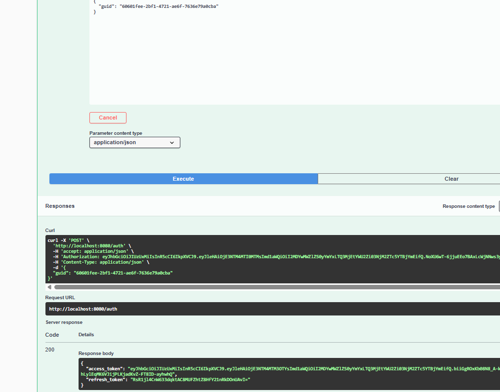
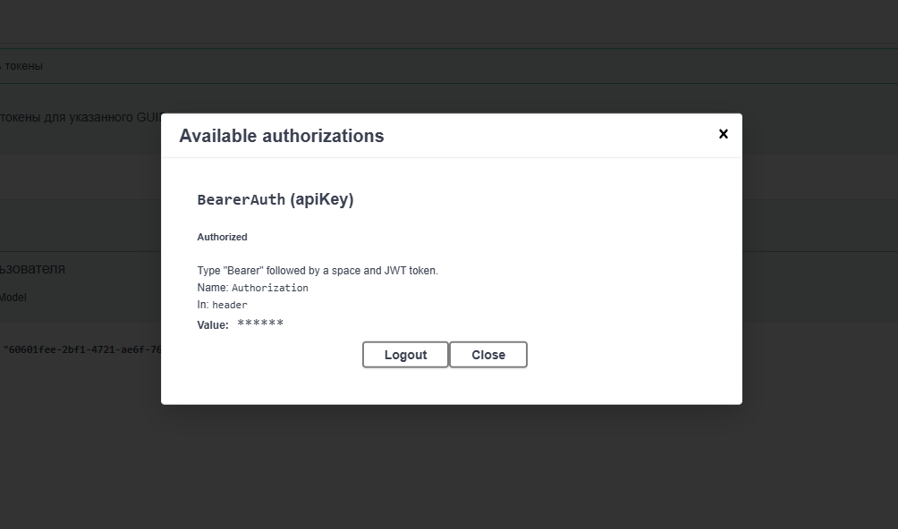

# Golang JWT Auth

  
*Пример интерфейса приложения*
  
*Пример интерфейса приложения*

```bash
# 1. Клонирование репозитория
git clone https://github.com/Imarzhobaboba/confidential_data_keeper.git
cd confidential_data_keeper

# 2. Запуск (сборка + инициализация)
docker-compose up --build -d

# 3. Доступ к приложению
http://localhost:8080/swagger/index.html